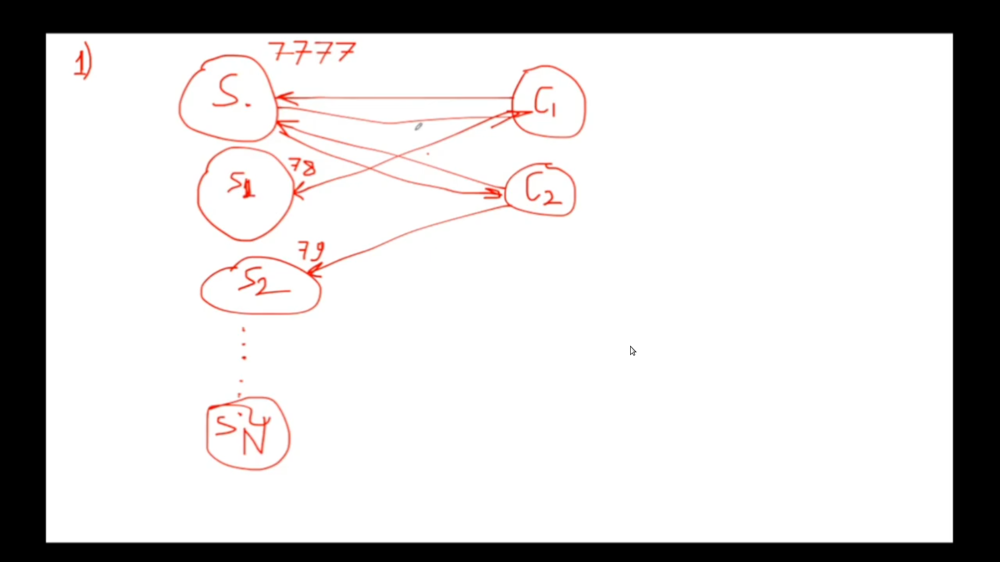
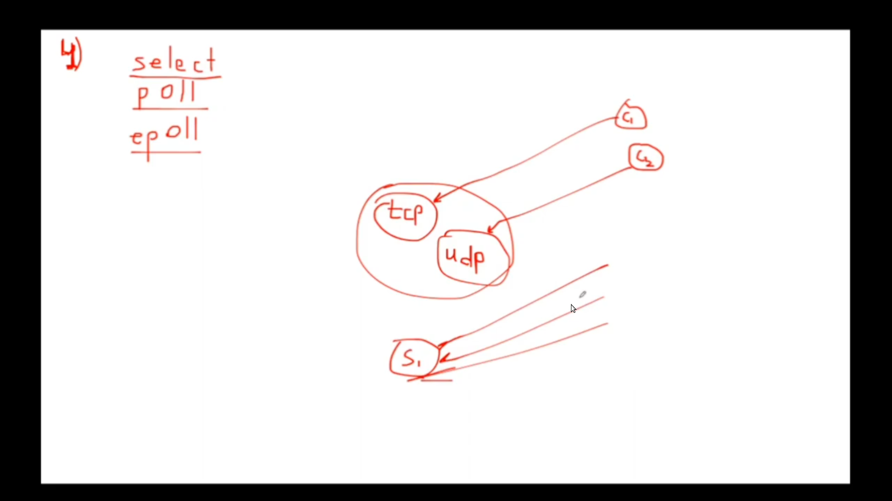

## task1
```
    Написать сервер который принимает команду time и отвечает текущим временем.
    Серевер для каждого пользователя создаёт отдельный поток и сокет для работы. 
```

## task2
```
    Написать сервер который принимает команду time и отвечает текущим временем.
    Серевер заранее создаёт определёное количество потоков и сокет для работы.
    Слушающий серевер хранит список состояния каждого потока. 
```

## task3
```
    Написать сервер который принимает команду time и отвечает текущим временем.
    Серевер заранее создаёт определёное количество потоков и сокет для работы.
    Слушающий серевер получает запрос на подключение и отпровляет его в очередь.
    Обслуживающий сервер отвечает клиенту. 
```

## task4
```
    Написать сервер который принимает команду time и отвечает текущим временем.
    Создать мульти протокольный сервер принимающий как tcp так и udp 
```
